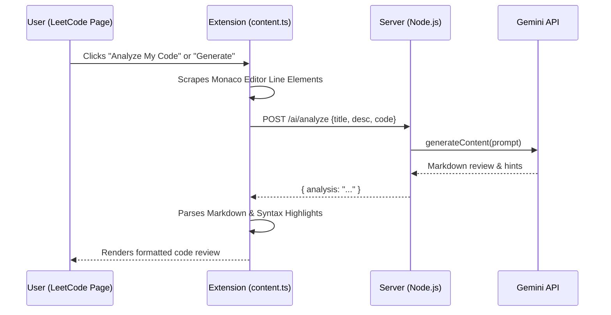

# CodeMate

> An advanced, real-time collaboration and AI-powered coding companion for LeetCode.

CodeMate is a comprehensive platform consisting of a browser extension and a real-time backend. It enhances the LeetCode experience by providing live presence tracking, peer-to-peer matchmaking, synchronized collaborative whiteboards, and an intelligent AI debugging assistant.

---

## 🚀 Key Features

* **Real-Time Presence Tracking:** Instantly view the number of active users currently solving the same LeetCode problem.
* **Peer-to-Peer Matchmaking:** Connect with other developers on the same problem via Socket.io and WebRTC for text and voice collaboration.
* **Collaborative Whiteboard:** A native HTML5 canvas integrated directly into the extension widget that synchronizes drawing strokes in real-time.
* **AI Code Debugger:** Analyzes the user's current code directly from the LeetCode Monaco editor, leveraging Google Gemini to provide specific hints and identify algorithmic bottlenecks without spoiling the full solution.
* **AI Solution Generator:** Generates an optimal, markdown-formatted solution with detailed Intuition, Approach, and Time/Space complexity breakdowns.

---

## 🏗 Architecture & Flow

The system consists of three interconnected layers: a Chrome MV3 Extension, a Node.js/Socket.io Backend, and a Next.js Web Application. 

The extension uses an injected Shadow DOM to ensure zero CSS conflicts with LeetCode. It communicates with the backend for real-time presence and AI processing.

### AI Generation Workflow



---

## 💻 Tech Stack

* **Extension Interface:** Chrome Manifest V3, Vanilla TypeScript, Injected Shadow DOM
* **Backend Services:** Node.js, Express, Socket.io (Real-time events & WebRTC Signaling)
* **Generative AI:** Google Gemini (`gemini-flash-latest`)
* **State & Caching:** Redis (Sorted sets, TTL expirations for presence tracking)
* **Web Frontend:** Next.js 14 (App Router)

---

## 🛠 Quick Start

### 1. Start the Backend

```bash
cd server
cp .env.example .env
# Important: Open .env and add your GEMINI_API_KEY from Google AI Studio
docker-compose up
```
*Spins up Redis on port `6379` and the Node.js Server on port `4000`.*

### 2. Start the Web Dashboard

```bash
cd web
cp .env.local.example .env.local
npm install
npm run dev
```

### 3. Load the Extension

1. Open `chrome://extensions` in your browser.
2. Enable **Developer mode** in the top right corner.
3. Click **Load unpacked** and select the `extension/` directory.

### 4. Usage

Navigate to any LeetCode problem. The CodeMate widget will automatically initialize in the bottom right corner, establishing a WebSocket connection to track presence and enabling the AI/Collaboration suites.

---

## 🔌 Socket Events Reference

| Event | Direction | Payload |
|-------|-----------|---------|
| `join:question` | Client → Server | `{ questionSlug, userId, displayName }` |
| `presence:update` | Server → Room | `{ questionSlug, count }` |
| `match:request` | Client → Server | `{ questionSlug }` |
| `match:accepted`| Server → Both | `{ sessionRoom, partnerSocketId }` |
| `chat:message`  | Client ↔ Server | `{ sessionRoom, message }` |
| `board:draw`    | Client ↔ Server | `{ sessionRoom, x0, y0, x1, y1, color }` |
| `board:clear`   | Client ↔ Server | `{ sessionRoom }` |
| `webrtc:offer`  | Client ↔ Server | `{ to, offer }` |

---

## 🗺 Roadmap

### Phase 1 ✅
- [x] Live user presence tracking
- [x] WebRTC signaling & random matchmaking
- [x] Extension UI and Chat widget

### Phase 2 ✅
- [x] AI Assistant (Generate optimized solutions using Gemini Flash)
- [x] Native Collaborative Whiteboard (Synched via Socket.io)
- [x] AI Code Debugger (DOM Scraper for Monaco editor analysis)

### Phase 3 🚧
- [ ] NextAuth User Accounts Integration
- [ ] Skill-based pairing (Easy / Medium / Hard matching algorithms)
- [ ] Session timers, Pomodoro mode, and user accountability streaks

---

## ⚖️ License
MIT License
